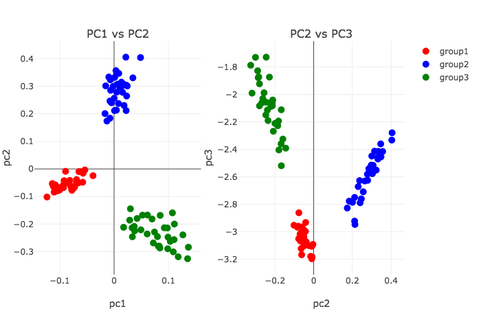

# OnlinePCA.jl
Online Principal Component Analysis

# Description
OnlinePCA.jl has some preprocess functions of CSV and PCA functions for extreamly large scale matrix.

# Algorithms
- SGD-PCA（Oja's method) : [Erkki Oja et. al., 1985](https://www.sciencedirect.com/science/article/pii/0022247X85901313), [Erkki Oja, 1992](https://www.sciencedirect.com/science/article/pii/S0893608005800899)
- CCIPCA : [Juyang Weng et. al., 2003](http://citeseerx.ist.psu.edu/viewdoc/download?doi=10.1.1.7.5665&rep=rep1&type=pdf)
- GD-PCA : None (Just for comparision with other methods)
- RSGD-PCA : [Silvere Bonnabel, 2013](https://arxiv.org/abs/1111.5280)
- SVRG-PCA : [Ohad Shamir, 2015](http://proceedings.mlr.press/v37/shamir15.pdf)
- RSVRG-PCA : [Hongyi Zhang, et. al., 2016](http://papers.nips.cc/paper/6515-riemannian-svrg-fast-stochastic-optimization-on-riemannian-manifolds.pdf), [Hiroyuki Sato, et. al., 2017](https://arxiv.org/abs/1702.05594)

# Learning Parameter Scheduling
- Robbins-Monro : [Herbert Robbins, et. al., 1951](https://projecteuclid.org/download/pdf_1/euclid.aoms/1177729586)
- Momentum : [Ning Qian, 1999](http://citeseerx.ist.psu.edu/viewdoc/download?doi=10.1.1.57.5612&rep=rep1&type=pdf)
- Nesterov's Accelerated Gradient Descent（NAG） : [Nesterov, 1983](https://scholar.google.com/scholar?cluster=9343343034975135646&hl=en&oi=scholarr)
- ADAGRAD : [John Duchi, et. al., 2011](http://www.jmlr.org/papers/volume12/duchi11a/duchi11a.pdf)

# Installation
<!-- ```julia
julia> Pkg.add("OnlinePCA")
```
 -->
```julia
Pkg.clone("git://github.com/rikenbit/OnlinePCA.jl.git")
```

# Basic API usage

## Preprocess of CSV
```julia
using OnlinePCA
using Distributions

# CSV
tmp = mktempdir()
input = Int64.(ceil.(rand(NegativeBinomial(1, 0.5), 300, 99)))
input[1:50, 1:33] .= 100*input[1:50, 1:33]
input[51:100, 34:66] .= 100*input[51:100, 34:66]
input[101:150, 67:99] .= 100*input[101:150, 67:99]
writecsv(tmp*"/Data.csv", input)

# Binarization
csv2sl(csvfile=tmp*"/Data.csv", slfile=tmp*"/Data.dat")

# Summary of data
sumr(slfile=tmp*"/Data.dat", outdir=tmp)
```

## Setting for plot
```julia
using PlotlyJS
using DataFrames

function subplots(respca, group)
	# data frame
	data_left = DataFrame(pc1=respca[1][:,1], pc2=respca[1][:,2], group=group)
	data_right = DataFrame(pc2=respca[1][:,2], pc3=respca[1][:,3], group=group)
	# plot
	p_left = Plot(data_left, x=:pc1, y=:pc2, mode="markers", marker_size=10, group=:group)
	p_right = Plot(data_right, x=:pc2, y=:pc3, mode="markers", marker_size=10, group=:group, showlegend=false)
	p_left.data[1]["marker_color"] = "red"
	p_left.data[2]["marker_color"] = "blue"
	p_left.data[3]["marker_color"] = "green"
	p_right.data[1]["marker_color"] = "red"
	p_right.data[2]["marker_color"] = "blue"
	p_right.data[3]["marker_color"] = "green"
	p_left.data[1]["name"] = "group1"
	p_left.data[2]["name"] = "group2"
	p_left.data[3]["name"] = "group3"
	p_left.layout["title"] = "PC1 vs PC2"
	p_right.layout["title"] = "PC2 vs PC3"
	p_left.layout["xaxis_title"] = "pc1"
	p_left.layout["yaxis_title"] = "pc2"
	p_right.layout["xaxis_title"] = "pc2"
	p_right.layout["yaxis_title"] = "pc3"
	plot([p_left p_right])
end

group=vcat(repeat(["group1"],inner=33), repeat(["group2"],inner=33), repeat(["group3"],inner=33))
```

## Oja's method
```julia
out_oja1 = oja(input=tmp*"/Data.dat", dim=3, scheduling="robbins-monro", stepsize=10, numepoch=10, meanlist=tmp*"/Feature_LogMeans.csv")
out_oja2 = oja(input=tmp*"/Data.dat", dim=3, scheduling="momentum", stepsize=0.01, numepoch=10, meanlist=tmp*"/Feature_LogMeans.csv")
out_oja3 = oja(input=tmp*"/Data.dat", dim=3, scheduling="nag", stepsize=0.01, numepoch=10, meanlist=tmp*"/Feature_LogMeans.csv")
out_oja4 = oja(input=tmp*"/Data.dat", dim=3, scheduling="adagrad", stepsize=0.1, numepoch=10, meanlist=tmp*"/Feature_LogMeans.csv")

subplots(out_oja1, group) # Top, Left
subplots(out_oja2, group) # Top, Right
subplots(out_oja3, group) # Bottom, Left
subplots(out_oja4, group) # Bottom, Right
```


## CCIPCA
```julia
out_ccipca1 = ccipca(input=tmp*"/Data.dat", dim=3, stepsize=1, numepoch=1, meanlist=tmp*"/Feature_LogMeans.csv")

subplots(out_ccipca1, group)
```


## GD-PCA
```julia
out_gd1 = gd(input=tmp*"/Data.dat", dim=3, scheduling="robbins-monro", stepsize=0.00001, numepoch=10, meanlist=tmp*"/Feature_LogMeans.csv")
out_gd2 = gd(input=tmp*"/Data.dat", dim=3, scheduling="momentum", stepsize=0.000001, numepoch=10, meanlist=tmp*"/Feature_LogMeans.csv")
out_gd3 = gd(input=tmp*"/Data.dat", dim=3, scheduling="nag", stepsize=0.0000001, numepoch=10, meanlist=tmp*"/Feature_LogMeans.csv")
out_gd4 = gd(input=tmp*"/Data.dat", dim=3, scheduling="adagrad", stepsize=0.0000001, numepoch=10, meanlist=tmp*"/Feature_LogMeans.csv")

subplots(out_gd1, group) # Top, Left
subplots(out_gd2, group) # Top, Right
subplots(out_gd3, group) # Bottom, Left
subplots(out_gd4, group) # Bottom, Right
```


## RSGD-PCA
```julia
out_rsgd1 = rsgd(input=tmp*"/Data.dat", dim=3, scheduling="robbins-monro", stepsize=10, numepoch=10, meanlist=tmp*"/Feature_LogMeans.csv")
out_rsgd2 = rsgd(input=tmp*"/Data.dat", dim=3, scheduling="momentum", stepsize=0.001, numepoch=10, meanlist=tmp*"/Feature_LogMeans.csv")
out_rsgd3 = rsgd(input=tmp*"/Data.dat", dim=3, scheduling="nag", stepsize=0.001, numepoch=10, meanlist=tmp*"/Feature_LogMeans.csv")
out_rsgd4 = rsgd(input=tmp*"/Data.dat", dim=3, scheduling="adagrad", stepsize=0.1, numepoch=10, meanlist=tmp*"/Feature_LogMeans.csv")

subplots(out_rsgd1, group) # Top, Left
subplots(out_rsgd2, group) # Top, Right
subplots(out_rsgd3, group) # Bottom, Left
subplots(out_rsgd4, group) # Bottom, Right
```


## SVRG-PCA
```julia
out_svrg1 = svrg(input=tmp*"/Data.dat", dim=3, scheduling="robbins-monro", stepsize=0.00001, numepoch=10, meanlist=tmp*"/Feature_LogMeans.csv")
out_svrg2 = svrg(input=tmp*"/Data.dat", dim=3, scheduling="momentum", stepsize=0.00001, numepoch=10, meanlist=tmp*"/Feature_LogMeans.csv")
out_svrg3 = svrg(input=tmp*"/Data.dat", dim=3, scheduling="nag", stepsize=0.00001, numepoch=10, meanlist=tmp*"/Feature_LogMeans.csv")
out_svrg4 = svrg(input=tmp*"/Data.dat", dim=3, scheduling="adagrad", stepsize=0.000001, numepoch=10, meanlist=tmp*"/Feature_LogMeans.csv")

subplots(out_svrg1, group) # Top, Left
subplots(out_svrg2, group) # Top, Right
subplots(out_svrg3, group) # Bottom, Left
subplots(out_svrg4, group) # Bottom, Right
```


## RSVRG-PCA
```julia
out_rsvrg1 = rsvrg(input=tmp*"/Data.dat", dim=3, scheduling="robbins-monro", stepsize=0.000001, numepoch=10, meanlist=tmp*"/Feature_LogMeans.csv")
out_rsvrg2 = rsvrg(input=tmp*"/Data.dat", dim=3, scheduling="momentum", stepsize=0.000001, numepoch=10, meanlist=tmp*"/Feature_LogMeans.csv")
out_rsvrg3 = rsvrg(input=tmp*"/Data.dat", dim=3, scheduling="nag", stepsize=0.000001, numepoch=10, meanlist=tmp*"/Feature_LogMeans.csv")
out_rsvrg4 = rsvrg(input=tmp*"/Data.dat", dim=3, scheduling="adagrad", stepsize=0.000001, numepoch=10, meanlist=tmp*"/Feature_LogMeans.csv")

subplots(out_rsvrg1, group) # Top, Left
subplots(out_rsvrg2, group) # Top, Right
subplots(out_rsvrg3, group) # Bottom, Left
subplots(out_rsvrg4, group) # Bottom, Right
```


# Command line usage
All the CSV preprocess functions and PCA functions also can be performed as command line tools with same parameter names like below.

```bash
# CSV → Julia Binary
julia YOUR_HOME_DIR/.julia/v0.x/OnlinePCA/bin/csv2sl --csvfile Data.csv --slfile Data.dat

# Summary statistics from Julia Binary
julia YOUR_HOME_DIR/.julia/v0.x/OnlinePCA/bin/sumr --slfile Data.dat

# PCA
julia YOUR_HOME_DIR/.julia/v0.x/OnlinePCA/bin/oja --input Data.dat --dim 3 --scheduling robbins-monro --stepsize 10, --numepoch 10 --meanlist Feature_LogMeans.csv
```