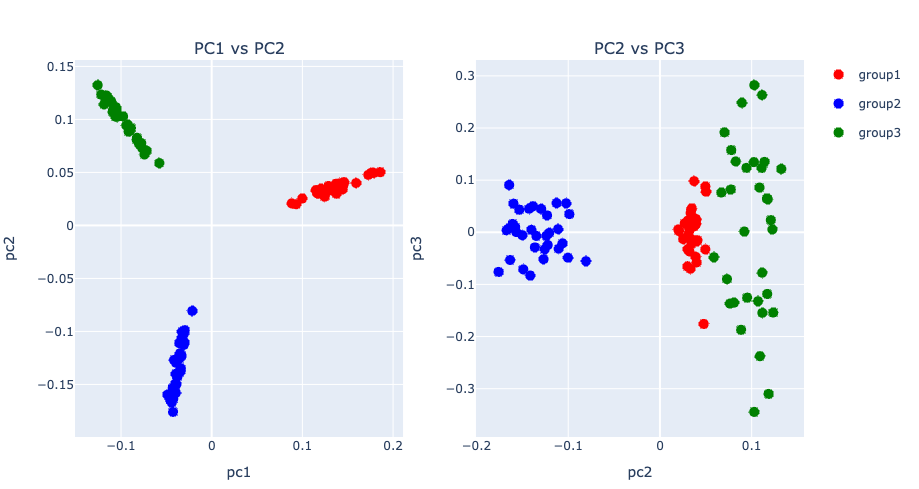
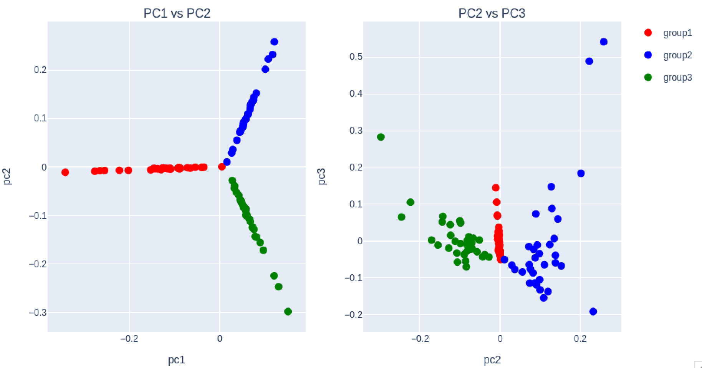
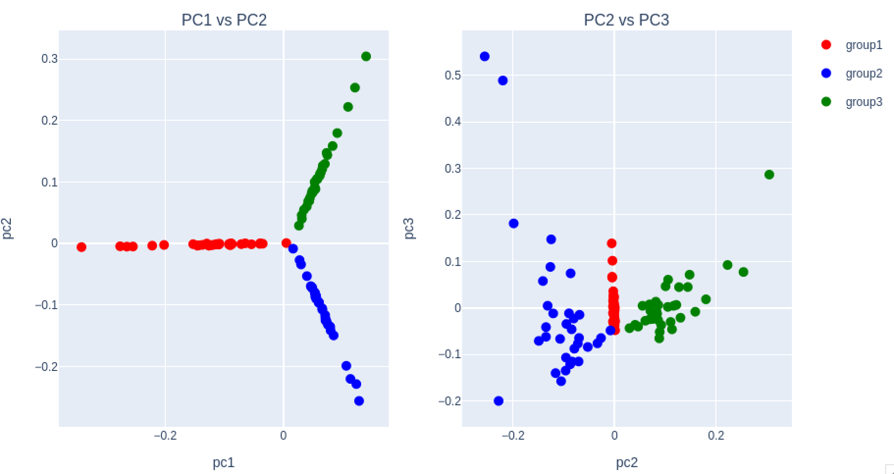

# OnlinePCA.jl
Online Principal Component Analysis

[](https://github.com/rikenbit/OnlinePCA.jl/actions/workflows/CI.yml?query=branch%3Amaster)
[](https://zenodo.org/badge/latestdoi/125349253)
[](https://doi.org/10.21105/joss.09343)

## 📚 Documentation
[](https://rikenbit.github.io/OnlinePCA.jl/dev)

## Description
OnlinePCA.jl binarizes CSV file, summarizes the information of data matrix and, performs some online-PCA functions for extreamely large scale matrix.

## Algorithms
- Gradient-based
	- GD-PCA
	- SGD-PCA
	- Oja's method : [Erkki Oja et. al., 1985](https://www.sciencedirect.com/science/article/pii/0022247X85901313), [Erkki Oja, 1992](https://www.sciencedirect.com/science/article/pii/S0893608005800899)
	- CCIPCA : [Juyang Weng et. al., 2003](http://citeseerx.ist.psu.edu/viewdoc/download?doi=10.1.1.7.5665&rep=rep1&type=pdf)
	- RSGD-PCA : [Silvere Bonnabel, 2013](https://arxiv.org/abs/1111.5280)
	- SVRG-PCA : [Ohad Shamir, 2015](http://proceedings.mlr.press/v37/shamir15.pdf)
	- RSVRG-PCA : [Hongyi Zhang, et. al., 2016](http://papers.nips.cc/paper/6515-riemannian-svrg-fast-stochastic-optimization-on-riemannian-manifolds.pdf), [Hiroyuki Sato, et. al., 2017](https://arxiv.org/abs/1702.05594)
- Krylov subspace-based
	- Orthgonal Iteration (A power method to calculate multiple eigenvectors at once) : [Zhaofun Bai, 1987](https://www.amazon.co.jp/Templates-Solution-Algebraic-Eigenvalue-Problems/dp/0898714710)
	- Arnoldi method : [Zhaofun Bai, 1987](https://www.amazon.co.jp/Templates-Solution-Algebraic-Eigenvalue-Problems/dp/0898714710)
	- Lanczos method : [Zhaofun Bai, 1987](https://www.amazon.co.jp/Templates-Solution-Algebraic-Eigenvalue-Problems/dp/0898714710)
- Random projection-based
	- Halko's method : [Halko, N., et. al., 2011](https://arxiv.org/abs/0909.4061), [Halko, N. et. al., 2011](https://epubs.siam.org/doi/abs/10.1137/100804139)
	- Algorithm971 : [George C. Linderman, et. al., 2017](https://arxiv.org/abs/1712.09005), [Huamin, Li, et. al., 2017](https://www.ncbi.nlm.nih.gov/pmc/articles/PMC5625842/), [Vladimir Rokhlin, et. al., 2009](https://arxiv.org/abs/0809.2274)
	- Randomized Block Krylov Iteration : [W, Yu, et. al., 2017](https://arxiv.org/abs/1504.05477)
	- Single-pass PCA : [C Musco, et. al., 2015](https://www.ijcai.org/proceedings/2017/0468.pdf)

## Learning Parameter Scheduling
- Robbins-Monro : [Herbert Robbins, et. al., 1951](https://projecteuclid.org/download/pdf_1/euclid.aoms/1177729586)
- Momentum : [Ning Qian, 1999](http://citeseerx.ist.psu.edu/viewdoc/download?doi=10.1.1.57.5612&rep=rep1&type=pdf)
- Nesterov's Accelerated Gradient Descent（NAG） : [Nesterov, 1983](https://scholar.google.com/scholar?cluster=9343343034975135646&hl=en&oi=scholarr)
- ADAGRAD : [John Duchi, et. al., 2011](http://www.jmlr.org/papers/volume12/duchi11a/duchi11a.pdf)

## Installation

### Requirements
- Julia 1.0 or later

### Installation Methods

**Method 1: Using Pkg.add()**
```julia
julia> Pkg.add(url="https://github.com/rikenbit/OnlinePCA.jl.git")
```

**Method 2: Using Pkg REPL mode**
```julia
# push the key "]" and type the following command.
(v1.7) pkg> add https://github.com/rikenbit/OnlinePCA.jl
# Press Backspace or Ctrl+C to return to Julia REPL
```

### Optional Dependencies

For interactive visualization of PCA results:
```julia
Pkg.add("PlotlyJS")
```

## Basic API usage

### Preprocess of CSV
```julia
using OnlinePCA
using OnlinePCA: write_csv
using Distributions
using DelimitedFiles
using SparseArrays
using MatrixMarket

# CSV
tmp = mktempdir()
data = Int64.(ceil.(rand(NegativeBinomial(1, 0.5), 300, 99)))
data[1:50, 1:33] .= 100*data[1:50, 1:33]
data[51:100, 34:66] .= 100*data[51:100, 34:66]
data[101:150, 67:99] .= 100*data[101:150, 67:99]
write_csv(joinpath(tmp, "Data.csv"), data)

# Binarization (Zstandard)
csv2bin(csvfile=joinpath(tmp, "Data.csv"), binfile=joinpath(tmp, "Data.zst"))

# Matrix Market (MM)
mmwrite(joinpath(tmp, "Data.mtx"), sparse(data))

# Summary of data for CSV/Dense Matrix
dense_path = mktempdir()
sumr(binfile=joinpath(tmp, "Data.zst"), outdir=dense_path)
```

### Setting for plot
```julia
using DataFrames
using PlotlyJS

function subplots(respca, group)
	# data frame
	data_left = DataFrame(pc1=respca[:,1], pc2=respca[:,2], group=group)
	data_right = DataFrame(pc2=respca[:,2], pc3=respca[:,3], group=group)
	# plot
	p_left = Plot(data_left, x=:pc1, y=:pc2, mode="markers", marker_size=10, group=:group)
	p_right = Plot(data_right, x=:pc2, y=:pc3, mode="markers", marker_size=10,
	group=:group, showlegend=false)
	p_left.data[1]["marker_color"] = "red"
	p_left.data[2]["marker_color"] = "blue"
	p_left.data[3]["marker_color"] = "green"
	p_right.data[1]["marker_color"] = "red"
	p_right.data[2]["marker_color"] = "blue"
	p_right.data[3]["marker_color"] = "green"
	p_left.data[1]["name"] = "group1"
	p_left.data[2]["name"] = "group2"
	p_left.data[3]["name"] = "group3"
	p_left.layout["title"] = "PC1 vs PC2"
	p_right.layout["title"] = "PC2 vs PC3"
	p_left.layout["xaxis_title"] = "pc1"
	p_left.layout["yaxis_title"] = "pc2"
	p_right.layout["xaxis_title"] = "pc2"
	p_right.layout["yaxis_title"] = "pc3"
	plot([p_left p_right])
end

group=vcat(repeat(["group1"],inner=33), repeat(["group2"],inner=33), repeat(["group3"],inner=33))
```

### GD-PCA
```julia
out_gd1 = gd(input=joinpath(tmp, "Data.zst"), dim=3, scheduling="robbins-monro", stepsize=1E-3,
    numepoch=10, rowmeanlist=joinpath(dense_path, "Feature_LogMeans.csv"))
out_gd2 = gd(input=joinpath(tmp, "Data.zst"), dim=3, scheduling="momentum", stepsize=1E-3,
    numepoch=10, rowmeanlist=joinpath(dense_path, "Feature_LogMeans.csv"))
out_gd3 = gd(input=joinpath(tmp, "Data.zst"), dim=3, scheduling="nag", stepsize=1E-3,
    numepoch=10, rowmeanlist=joinpath(dense_path, "Feature_LogMeans.csv"))
out_gd4 = gd(input=joinpath(tmp, "Data.zst"), dim=3, scheduling="adagrad", stepsize=1E-0,
    numepoch=10, rowmeanlist=joinpath(dense_path, "Feature_LogMeans.csv"))

subplots(out_gd1[1], group) # Top, Left
subplots(out_gd2[1], group) # Top, Right
subplots(out_gd3[1], group) # Bottom, Left
subplots(out_gd4[1], group) # Bottom, Right
```


### SGD-PCA
```julia
out_sgd1 = sgd(input=joinpath(tmp, "Data.zst"), dim=3, scheduling="robbins-monro", stepsize=1E-3,
    numbatch=100, numepoch=10, rowmeanlist=joinpath(dense_path, "Feature_LogMeans.csv"))
out_sgd2 = sgd(input=joinpath(tmp, "Data.zst"), dim=3, scheduling="momentum", stepsize=1E-3,
    numbatch=100, numepoch=10, rowmeanlist=joinpath(dense_path, "Feature_LogMeans.csv"))
out_sgd3 = sgd(input=joinpath(tmp, "Data.zst"), dim=3, scheduling="nag", stepsize=1E-3,
    numbatch=100, numepoch=10, rowmeanlist=joinpath(dense_path, "Feature_LogMeans.csv"))
out_sgd4 = sgd(input=joinpath(tmp, "Data.zst"), dim=3, scheduling="adagrad", stepsize=1E-0,
    numbatch=100, numepoch=10, rowmeanlist=joinpath(dense_path, "Feature_LogMeans.csv"))

subplots(out_sgd1[1], group) # Top, Left
subplots(out_sgd2[1], group) # Top, Right
subplots(out_sgd3[1], group) # Bottom, Left
subplots(out_sgd4[1], group) # Bottom, Right
```


### Oja's method
```julia
out_oja1 = oja(input=joinpath(tmp, "Data.zst"), dim=3, scheduling="robbins-monro", stepsize=1E+0,
    numepoch=10, rowmeanlist=joinpath(dense_path, "Feature_LogMeans.csv"))
out_oja2 = oja(input=joinpath(tmp, "Data.zst"), dim=3, scheduling="momentum", stepsize=1E-3,
    numepoch=10, rowmeanlist=joinpath(dense_path, "Feature_LogMeans.csv"))
out_oja3 = oja(input=joinpath(tmp, "Data.zst"), dim=3, scheduling="nag", stepsize=1E-3,
    numepoch=10, rowmeanlist=joinpath(dense_path, "Feature_LogMeans.csv"))
out_oja4 = oja(input=joinpath(tmp, "Data.zst"), dim=3, scheduling="adagrad", stepsize=1E-1,
    numepoch=10, rowmeanlist=joinpath(dense_path, "Feature_LogMeans.csv"))

subplots(out_oja1[1], group) # Top, Left
subplots(out_oja2[1], group) # Top, Right
subplots(out_oja3[1], group) # Bottom, Left
subplots(out_oja4[1], group) # Bottom, Right
```


### CCIPCA
```julia
out_ccipca1 = ccipca(input=joinpath(tmp, "Data.zst"), dim=3, stepsize=1E-0,
    numepoch=10, rowmeanlist=joinpath(dense_path, "Feature_LogMeans.csv"))

subplots(out_ccipca1[1], group)
```


### RSGD-PCA
```julia
out_rsgd1 = rsgd(input=joinpath(tmp, "Data.zst"), dim=3, scheduling="robbins-monro", stepsize=1E+2,
    numepoch=10, rowmeanlist=joinpath(dense_path, "Feature_LogMeans.csv"))
out_rsgd2 = rsgd(input=joinpath(tmp, "Data.zst"), dim=3, scheduling="momentum", stepsize=1E-3,
    numepoch=10, rowmeanlist=joinpath(dense_path, "Feature_LogMeans.csv"))
out_rsgd3 = rsgd(input=joinpath(tmp, "Data.zst"), dim=3, scheduling="nag", stepsize=1E-3,
    numepoch=10, rowmeanlist=joinpath(dense_path, "Feature_LogMeans.csv"))
out_rsgd4 = rsgd(input=joinpath(tmp, "Data.zst"), dim=3, scheduling="adagrad", stepsize=1E-1,
    numepoch=10, rowmeanlist=joinpath(dense_path, "Feature_LogMeans.csv"))

subplots(out_rsgd1[1], group) # Top, Left
subplots(out_rsgd2[1], group) # Top, Right
subplots(out_rsgd3[1], group) # Bottom, Left
subplots(out_rsgd4[1], group) # Bottom, Right
```


### SVRG-PCA
```julia
out_svrg1 = svrg(input=joinpath(tmp, "Data.zst"), dim=3, scheduling="robbins-monro", stepsize=1E-5,
    numepoch=10, rowmeanlist=joinpath(dense_path, "Feature_LogMeans.csv"))
out_svrg2 = svrg(input=joinpath(tmp, "Data.zst"), dim=3, scheduling="momentum", stepsize=1E-5,
    numepoch=10, rowmeanlist=joinpath(dense_path, "Feature_LogMeans.csv"))
out_svrg3 = svrg(input=joinpath(tmp, "Data.zst"), dim=3, scheduling="nag", stepsize=1E-5,
    numepoch=10, rowmeanlist=joinpath(dense_path, "Feature_LogMeans.csv"))
out_svrg4 = svrg(input=joinpath(tmp, "Data.zst"), dim=3, scheduling="adagrad", stepsize=1E-2,
    numepoch=10, rowmeanlist=joinpath(dense_path, "Feature_LogMeans.csv"))

subplots(out_svrg1[1], group) # Top, Left
subplots(out_svrg2[1], group) # Top, Right
subplots(out_svrg3[1], group) # Bottom, Left
subplots(out_svrg4[1], group) # Bottom, Right
```


### RSVRG-PCA
```julia
out_rsvrg1 = rsvrg(input=joinpath(tmp, "Data.zst"), dim=3, scheduling="robbins-monro", stepsize=1E-6,
    numepoch=10, rowmeanlist=joinpath(dense_path, "Feature_LogMeans.csv"))
out_rsvrg2 = rsvrg(input=joinpath(tmp, "Data.zst"), dim=3, scheduling="momentum", stepsize=1E-6,
    numepoch=10, rowmeanlist=joinpath(dense_path, "Feature_LogMeans.csv"))
out_rsvrg3 = rsvrg(input=joinpath(tmp, "Data.zst"), dim=3, scheduling="nag", stepsize=1E-6,
    numepoch=10, rowmeanlist=joinpath(dense_path, "Feature_LogMeans.csv"))
out_rsvrg4 = rsvrg(input=joinpath(tmp, "Data.zst"), dim=3, scheduling="adagrad", stepsize=1E-2,
    numepoch=10, rowmeanlist=joinpath(dense_path, "Feature_LogMeans.csv"))

subplots(out_rsvrg1[1], group) # Top, Left
subplots(out_rsvrg2[1], group) # Top, Right
subplots(out_rsvrg3[1], group) # Bottom, Left
subplots(out_rsvrg4[1], group) # Bottom, Right
```


### Orthogonal Iteration (Power method)
```julia
out_orthiter = orthiter(input=joinpath(tmp, "Data.zst"), dim=3,
    rowmeanlist=joinpath(dense_path, "Feature_LogMeans.csv"))

subplots(out_orthiter[1], group)
```


### Arnoldi method
```julia
out_arnoldi = arnoldi(input=joinpath(tmp, "Data.zst"), dim=3,
    rowmeanlist=joinpath(dense_path, "Feature_LogMeans.csv"))

subplots(out_arnoldi[1], group)
```


### Lanczos method
```julia
out_lanczos = lanczos(input=joinpath(tmp, "Data.zst"), dim=3,
    rowmeanlist=joinpath(dense_path, "Feature_LogMeans.csv"))

subplots(out_lanczos[1], group)
```


### Halko's method
```julia
out_halko = halko(input=joinpath(tmp, "Data.zst"), dim=3,
    rowmeanlist=joinpath(dense_path, "Feature_LogMeans.csv"))

subplots(out_halko[1], group)
```


### Algorithm 971
```julia
out_algorithm971 = algorithm971(input=joinpath(tmp, "Data.zst"), dim=3,
    rowmeanlist=joinpath(dense_path, "Feature_LogMeans.csv"))

subplots(out_algorithm971[1], group)
```


### Randomized Block Krylov Iteration
```julia
out_rbkiter = rbkiter(input=joinpath(tmp, "Data.zst"), dim=3,
    rowmeanlist=joinpath(dense_path, "Feature_LogMeans.csv"))

subplots(out_rbkiter[1], group)
```


### Single-pass PCA type I
```julia
out_singlepass = singlepass(input=joinpath(tmp, "Data.zst"), dim=3,
    rowmeanlist=joinpath(dense_path, "Feature_LogMeans.csv"))

subplots(out_singlepass[1], group)
```


### Single-pass PCA type II
```julia
out_singlepass2 = singlepass2(input=joinpath(tmp, "Data.zst"), dim=3,
    rowmeanlist=joinpath(dense_path, "Feature_LogMeans.csv"))

subplots(out_singlepass2[1], group)
```


### Summarization for 10X-HDF5
```julia
tenxsumr(tenxfile="Data.h5", group="mm10", chunksize=100)
```

### Algorithm 971 for 10X-HDF5
```julia
out_tenxpca = tenxpca(tenxfile="Data.h5", scale="sqrt",
    rowmeanlist="Feature_SqrtMeans.csv", dim=3, chunksize=100, group="mm10")
```

### Summary of data for MM/Sparse Matrix
```julia
# Sparsification + Binarization (Zstandard + MM format)
mm2bin(mmfile=joinpath(tmp, "Data.mtx"), binfile=joinpath(tmp, "Data.mtx.zst"))

sparse_path = mktempdir()
sumr(binfile=joinpath(tmp, "Data.mtx.zst"), outdir=sparse_path, mode="sparse_mm")
```

### Sparse Randomized SVD for MM format
```julia
out_sparse_rsvd = sparse_rsvd(
	input=joinpath(tmp, "Data.mtx.zst"),
	scale="ftt",
    rowmeanlist=joinpath(sparse_path, "Feature_FTTMeans.csv"),
	dim=3, chunksize=100)

subplots(out_sparse_rsvd[1], group)
```


### Exact Out-of-Core PCA
Unlike other PCAs, this function assumes matrix data with data x dimensions. It is also computationally efficient when the data is vertical with number of data >> number of dimensions. In the following, data assuming this assumption are first prepared. The function can also be used without performing a sumr to extract row and column statistics in advance.

```julia
# CSV
tmp2 = mktempdir()
data2 = Int64.(ceil.(rand(NegativeBinomial(1, 0.5), 99, 30)))
data2[1:33, 1:10] .= 100*data2[1:33, 1:10]
data2[34:66, 11:20] .= 100*data2[34:66, 11:20]
data2[67:99, 21:30] .= 100*data2[67:99, 21:30]
write_csv(joinpath(tmp2, "Data2.csv"), data2)

# Binarization (Zstandard)
csv2bin(csvfile=joinpath(tmp2, "Data2.csv"), binfile=joinpath(tmp2, "Data2.zst"))

# Matrix Market (MM)
mmwrite(joinpath(tmp2, "Data2.mtx"), sparse(data2))

# Binary COO (BinCOO)
data3 = Int64.(ceil.(rand(Binomial(1, 0.2), 99, 33)))
data3[1:33, 1:11] .= 1
data3[34:66, 12:22] .= 1
data3[67:99, 23:33] .= 1

bincoofile = joinpath(tmp2, "Data3.bincoo")
open(bincoofile, "w") do io
    for i in 1:size(data3, 1)
        for j in 1:size(data3, 2)
            if data3[i, j] != 0
                println(io, "$i $j")
            end
        end
    end
end

# Binarization (CSV + Zstandard)
csv2bin(csvfile=joinpath(tmp2, "Data2.csv"), binfile=joinpath(tmp2, "Data2.zst"))

# Binarization (MM + Zstandard)
mm2bin(mmfile=joinpath(tmp2, "Data2.mtx"), binfile=joinpath(tmp2, "Data2.mtx.zst"))

# Binarziation (BinCOO + Zstandard)
bincoo2bin(bincoofile=bincoofile, binfile=joinpath(tmp2, "Data3.bincoo.zst"))
```

```julia
# Dense-mode
out_exact_ooc_pca_dense = exact_ooc_pca(
	input=joinpath(tmp2, "Data2.zst"),
	scale="raw", dim=3, chunksize=10)

subplots(out_exact_ooc_pca_dense[3], group)
```


```julia
# Sparse-mode (MM)
out_exact_ooc_pca_sparse_mm = exact_ooc_pca(
	input=joinpath(tmp2, "Data2.mtx.zst"),
	scale="raw", dim=3, chunksize=10, mode="sparse_mm")

subplots(out_exact_ooc_pca_sparse_mm[3], group)
```


```julia
# Sparse-mode (BinCOO)
out_exact_ooc_pca_sparse_bincoo = exact_ooc_pca(
	input=joinpath(tmp2, "Data3.bincoo.zst"),
	scale="raw", dim=3, chunksize=10, mode="sparse_bincoo")

subplots(out_exact_ooc_pca_sparse_bincoo[3], group)
```


## Command line usage
All the CSV preprocess functions and PCA functions also can be performed as command line tools with same parameter names like below.

```bash
# CSV → Julia Binary (e.g, csv2bin, mm2bin)
julia YOUR_HOME_DIR/.julia/v0.x/OnlinePCA/bin/csv2bin \
    --csvfile Data.csv --binfile Data.zst

# Summary statistics extracted from Julia Binary (e.g., sumr, tenxsumr)
julia YOUR_HOME_DIR/.julia/v0.x/OnlinePCA/bin/sumr \
    --binfile Data.zst

# Perform PCA
julia YOUR_HOME_DIR/.julia/v0.x/OnlinePCA/bin/gd \
    --input Data.zst --dim 3 --scheduling robbins-monro --stepsize 10 \
    --numepoch 10 --rowmeanlist Feature_LogMeans.csv
```

## Distributed Computing with Multiple Stepsize Setting
The online PCA algorithms are performed until the reconstruction error is converged. In the default stopping criteria, the calculation is stopped when the relative change is bellow 1E-3 or above 0.03. These values can be changed by *lower* and *upper* options, respectively.

The convergence is depend on the step size parameter and default value is set as 1000. This value is tuned for single-cell RNA-Seq dataset, but the appropriate level may change according to the size and dynamic range of data matrix.

Combined with [Grid Engine](https://en.wikipedia.org/wiki/Oracle_Grid_Engine), this step is easily paralled, because each calculation of different step size are independently performed. For example, we firstly make the following template file (e.g., oja_template) containing the online PCA script,

```bash
#!/bin/bash

julia YOUR_HOME_DIR/.julia/v0.x/OnlinePCA/bin/oja \
--scale log \
--input Data.zst \
--outdir XXXXX \
--rowmeanlist Feature_LogMeans.csv \
--dim 10 \
--stepsize YYYYY \
--logdir XXXXX/log
```

and then rewrite the template to set different step size by sed command and submit each job by qsub command.

```bash
#!/bin/bash

Steps=(1 10 100 1000 10000 100000 1000000)
for i in ${Step[@]}; do
	OUT="Step"$i
	mkdir -p $OUT
	sed -e "s|XXXXX|$OUT|g" oja_template > TMP_oja_scData.sh
	sed -e "s|YYYYY|$i|g" TMP_oja_scData.sh > oja_scData.sh
	chmod +x oja_scData.sh
	qsub oja_scData.sh
done
```

Even if there are no distributed computational environment, background process is applicable (just adding & in the end of command).

```bash
#!/bin/bash

Steps=(1 10 100 1000 10000 100000 1000000)
for i in ${Steps[@]}; do
	mkdir -p "Step"$i
	julia YOUR_HOME_DIR/.julia/v0.x/OnlinePCA/bin/oja \
	--scale log \
	--input Data.zst \
	--outdir "Step"$i \
	--rowmeanlist Feature_LogMeans.csv \
	--dim 10 \
	--stepsize $i \
	--logdir "Step"$i/log &
done

ps | grep julia
```

## Contributing

If you have suggestions for how `OnlinePCA.jl` could be improved, or want to report a bug, open an issue! We'd love all and any contributions.

For more, check out the [Contributing Guide](CONTRIBUTING.md).

## Author
- Koki Tsuyuzaki
