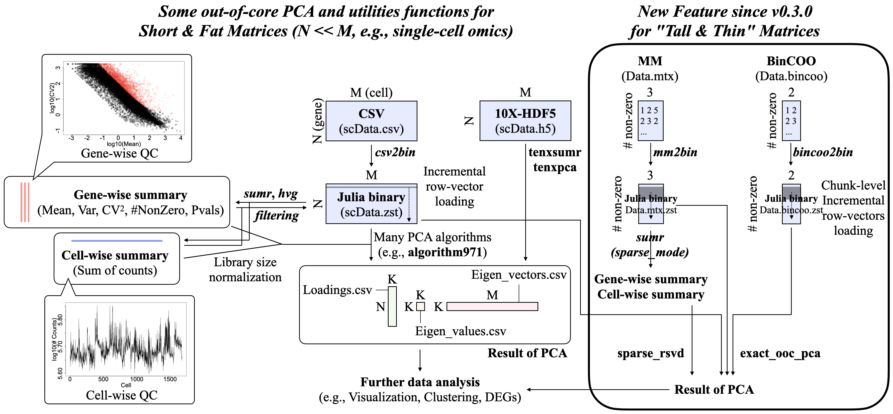
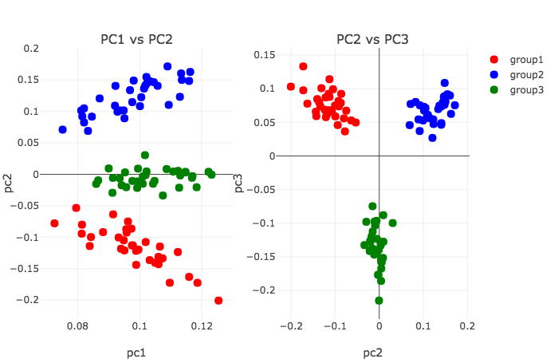
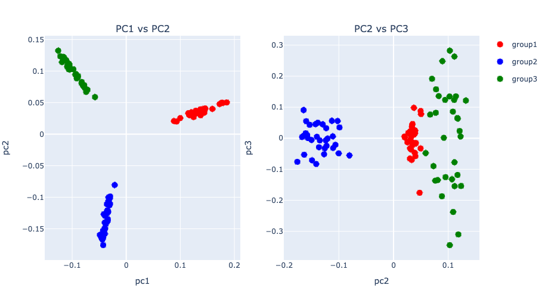
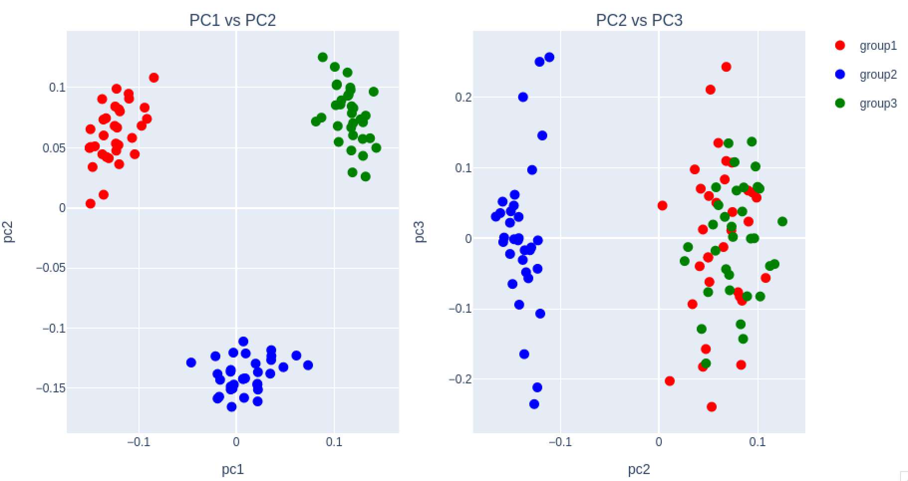

# Summary

Principal Component Analysis (PCA) is a widely used dimensionality reduction technique [@review1; @review2], but becomes computationally prohibitive for large data matrices. Recent advances in single-cell omics have led to datasets with millions of cells, for which standard PCA implementations often fail to scale. \texttt{OnlinePCA.jl} is a Julia package that addresses this challenge by providing scalable PCA algorithms (\url{https://github.com/rikenbit/OnlinePCA.jl}).

# Statement of need

PCA is widely used across diverse fields including face recognition [@eigenface], animal behavior [@eigenworm], genomics [@review1; @review2], population genetics [@genetics; @pcaone], and molecular dynamics [@md]. However, large data matrices often exceed available memory. An out-of-core (OOC) implementation—where data subsets are loaded from disk—combined with sparse matrix support is highly desirable [@onlinepcajl].

## New features since version 0.3.0

\texttt{OnlinePCA.jl} previously provided OOC PCA functions and \texttt{tenxpca} for 10X-HDF5 sparse matrices [@onlinepcajl]. These implementations were designed for "short and fat" matrices with few rows (samples) and many columns (features). Since version 0.3.0, the following features have been introduced:

- *Support for Matrix Market and Binary COO formats*: We implemented \texttt{mm2bin} and \texttt{bincoo2bin} for binary conversion of sparse data, and extended \texttt{sumr} with a \texttt{sparse\_mode} option.
- *\texttt{sparse\_rsvd}*: Generalizes \texttt{tenxpca} to Matrix Market format.
- *\texttt{exact\_ooc\_pca}*: Designed for "tall and thin" matrices, this function computes the covariance matrix in OOC manner followed by eigendecomposition. Supports CSV, MM, and BinCOO formats. Results are mathematically equivalent to offline PCA.
- *Adjustable chunk size*: Both \texttt{sparse\_rsvd} and \texttt{exact\_ooc\_pca} include a \texttt{chunksize} option for memory control.

{ width=100% }

# Example

PCA can be easily reproduced on any machine where Julia is pre-installed by using the following commands in the Julia REPL window:

## Installation

First, install \texttt{OnlinePCA.jl} from the official Julia package registry or directly from GitHub:

```julia
# Install OnlinePCA.jl from Julia General
julia> Pkg.add("OnlinePCA")

# or GitHub for the latest version
julia> Pkg.add(url="https://github.com/rikenbit/OnlinePCA.jl.git")
```

## Preprocess of CSV

Then, write a synthetic data as a CSV file, convert it to a compressed binary format using Zstandard, and prepare summary statistics for PCA. Matrix Market (MM) format is also supported for sparse matrices.

```julia
using OnlinePCA
using OnlinePCA: write_csv
using Distributions
using DelimitedFiles
using SparseArrays
using MatrixMarket

# CSV
tmp = mktempdir()
data = Int64.(ceil.(rand(NegativeBinomial(1, 0.5), 300, 99)))
data[1:50, 1:33] .= 100*data[1:50, 1:33]
data[51:100, 34:66] .= 100*data[51:100, 34:66]
data[101:150, 67:99] .= 100*data[101:150, 67:99]
write_csv(joinpath(tmp, "Data.csv"), data)

# Binarization (Zstandard)
csv2bin(csvfile=joinpath(tmp, "Data.csv"),
    binfile=joinpath(tmp, "Data.zst"))

# Matrix Market (MM)
mmwrite(joinpath(tmp, "Data.mtx"), sparse(data))

# Binarization (Zstandard)
csv2bin(csvfile=joinpath(tmp, "Data.csv"),
    binfile=joinpath(tmp, "Data.zst"))

# Summary of data for CSV/Dense Matrix
dense_path = mktempdir()
sumr(binfile=joinpath(tmp, "Data.zst"), outdir=dense_path)
```

## PCA using Halko’s method on CSV input

This example performs PCA using Halko's randomized SVD method on dense CSV input. Results are visualized using the \texttt{subplots} function defined in the README (\url{https://github.com/rikenbit/OnlinePCA.jl?tab=readme-ov-file#setting-for-plot}).

```julia
out_halko = halko(input=joinpath(tmp, "Data.zst"), dim=3,
    scale="log",
    rowmeanlist=joinpath(dense_path, "Feature_LogMeans.csv"))

subplots(out_halko[1], group)
```

{ width=100% }

## Preprocessing sparse data in Matrix Market format

The following code converts a sparse matrix in MM format into a binary compressed format and computes summary statistics for PCA.

```julia
# Sparsification + Binarization (Zstandard + MM format)
mm2bin(mmfile=joinpath(tmp, "Data.mtx"),
    binfile=joinpath(tmp, "Data.mtx.zst"))

sparse_path = mktempdir()
sumr(binfile=joinpath(tmp, "Data.mtx.zst"),
    outdir=sparse_path, mode="sparse_mm")
```

## PCA using \texttt{sparse\_rsvd} on Matrix Market input

This example performs PCA using the \texttt{sparse\_rsvd} method, designed for sparse input data in MM format. The top 3 components are visualized.

```julia
out_sparse_rsvd = sparse_rsvd(
  input=joinpath(tmp, "Data.mtx.zst"),
  scale="ftt",
  rowmeanlist=joinpath(sparse_path, "Feature_FTTMeans.csv"),
  dim=3, chunksize=100)

subplots(out_sparse_rsvd[1], group)
```

{ width=100% }


## Preparing another sparse matrix for \texttt{exact\_ooc\_pca}

This example generates a BinCOO format data to simulate "tall and thin" matrix and compresses it by \texttt{bincoo2bin} for use with \texttt{exact\_ooc\_pca}.

```julia
# Binary COO (BinCOO)
tmp2 = mktempdir()
data2 = Int64.(ceil.(rand(Binomial(1, 0.2), 99, 33)))
data2[1:33, 1:11] .= 1
data2[34:66, 12:22] .= 1
data2[67:99, 23:33] .= 1

bincoofile = joinpath(tmp2, "Data2.bincoo")
open(bincoofile, "w") do io
    for i in 1:size(data2, 1)
        for j in 1:size(data2, 2)
            if data2[i, j] != 0
                println(io, "$i $j")
            end
        end
    end
end

# Binarziation (BinCOO + Zstandard)
bincoo2bin(bincoofile=bincoofile, binfile=joinpath(tmp2, "Data2.bincoo.zst"))
```

## PCA using \texttt{exact\_ooc\_pca} on BinCOO input

Here, we apply \texttt{exact\_ooc\_pca}, which computes the full covariance matrix in a OOC manner and performs eigendecomposition.

```julia
# Sparse-mode (BinCOO)
out_exact_ooc_pca_sparse_bincoo = exact_ooc_pca(
  input=joinpath(tmp2, "Data2.bincoo.zst"),
  scale="raw", dim=3, chunksize=10, mode="sparse_bincoo")

subplots(out_exact_ooc_pca_sparse_bincoo[3], group)
```

{ width=100% }

For more details, see the README.md of \texttt{OnlinePCA.jl} at \url{https://github.com/rikenbit/OnlinePCA.jl}.

# Related work

There are various implementations of PCA and some of them are OOC-type or sparse-type [@sklearn; @dask; @pcaone] but \texttt{OnlinePCA.jl} is the only tool that supports both OOC computation and sparse data formats (e.g., 10X-HDF5, MM, BinCOO).

| Function Name | Language | OOC | Sparse Format |
|:------ | :----: | :----: | :----: |
| \texttt{prcomp/princomp} | R | No | - |
| \texttt{sklearn.decomposition.PCA} | Python | No | - |
| \texttt{MultivariateStats.PCA} | Julia | No | - |
| \texttt{oocRPCA::oocPCA\_CSV} | R | Yes | - |
| \texttt{sklearn.decomposition.IncrementalPCA} | Python | Yes | - |
| \texttt{dask\_ml.decomposition.PCA} | Python | Yes | - |
| \texttt{PCAone} | R/C++ | Yes | - |
| \texttt{irlba::prcomp\_irlba} | R | No | dgCMatrix |
| \texttt{sklearn.decomposition.TruncatedSVD} | Python | No | scipy.sparse |
| \texttt{tenxpca} | Julia | Yes | 10X-HDF5 |
| \texttt{sparse\_rsvd} | Julia | Yes | MM |
| \texttt{exact\_ooc\_pca} | Julia | Yes | CSV/MM/BinCOO |

For a more comprehensive comparison, see the Figure 2 in @onlinepcajl.

# References
